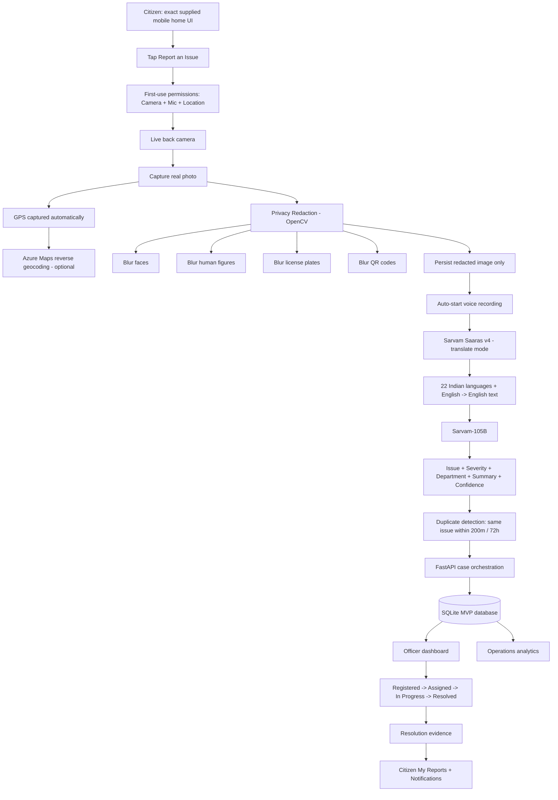

# InfraGuard AI — Final Architecture

## Stack

- Citizen interface: HTML, CSS, JavaScript
- Camera / microphone: Web Media APIs
- GPS: Browser Geolocation API
- Reverse geocoding: Azure Maps (optional key)
- Privacy redaction: OpenCV
- Voice-to-English: Sarvam Saaras v4, `mode=translate`
- AI triage: Sarvam-105B
- Backend: Python FastAPI + Uvicorn
- MVP database: SQLite
- Evidence: local processed image storage
- Repository: GitHub
- Production target: Azure App Service / Container Apps + Blob Storage + PostgreSQL + Key Vault + Entra + Application Insights
